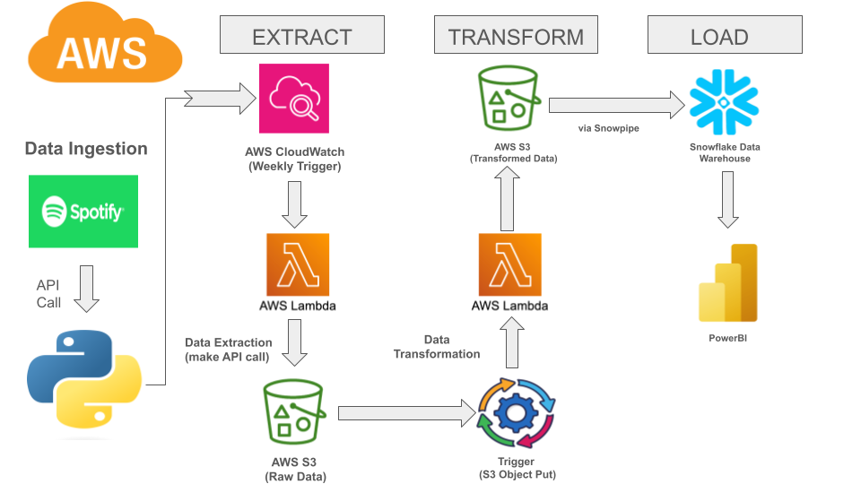
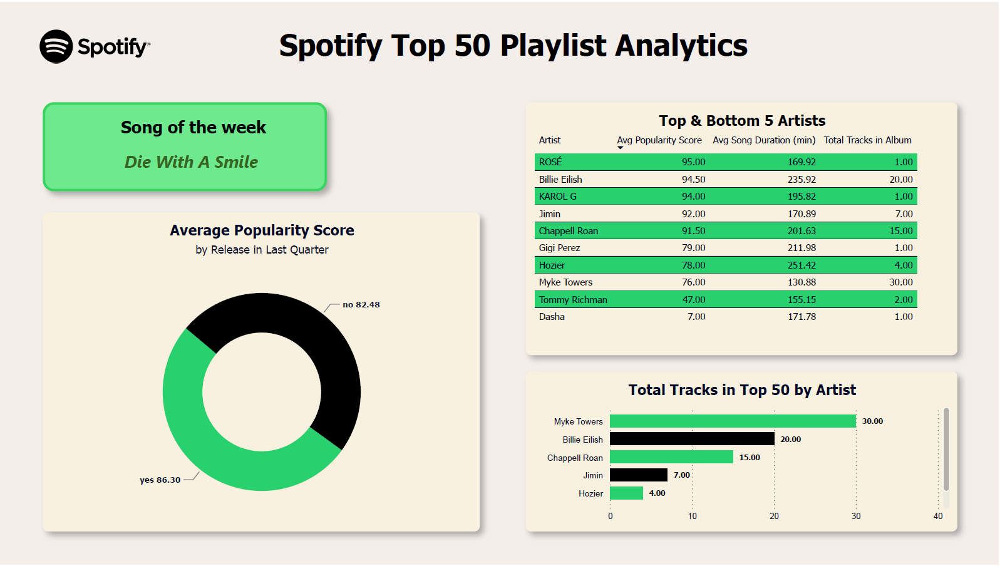

# Spotify Top 50 ETL Pipeline w/Snowflake & AWS

A serverless data pipeline that extracts Spotify's Top 50 playlist data weekly, transforms it into analytical datasets, and loads it into a Snowflake for business analytics.

## Architecture Overview



The solution uses a serverless architecture pattern with the following components:

- **Data Source**: Spotify API (Top 50 Playlist)
- **Extraction**: AWS Lambda + CloudWatch trigger (weekly)
- **Storage**: AWS S3 (Raw JSON & Transformed CSV)
- **Transformation**: AWS Lambda
- **Data Warehouse**: Snowflake
- **Data Loading**: Snowpipe
- **Visualization**: PowerBI

## Implementation Details

### Data Extraction
- AWS CloudWatch triggers a Lambda function weekly
- Lambda authenticates with Spotify API using environment variables for credentials
- Raw JSON response is stored in S3 bucket: `spotify-etl-pipeline-sn/raw_data/to_be_processed/`

### Data Transformation
- S3 put event triggers transformation Lambda
- Data is transformed into three normalized entities:
  - Songs (metrics like duration, popularity, etc.)
  - Artists (name, URL, etc.)
  - Albums (release date, total tracks, etc.)
- Transformed data is saved as CSV files in respective S3 directories

### Data Model
```sql
-- Songs Table
- song_id (PK)
- name
- duration_ms
- url
- popularity
- added_date
- album_id (FK)
- artist_id (FK)

-- Artists Table
- artist_id (PK)
- name
- url

-- Albums Table
- album_id (PK)
- name
- release_date
- total_tracks
- url
```

### Analytics Views
Several analytical views were created to support business intelligence:

1. **Record Count Monitoring**
   - Tracks total records across all entities

2. **Artist Analytics**
   - Top 5 artists by song count in playlist
   - Comprehensive artist metrics including:
     - Average popularity scores
     - Average song duration
     - Track appearances
     - Total tracks in albums

3. **Popularity Analysis**
   - Comparison of song popularity between recent releases (last quarter) and older tracks
   - Current top songs by popularity

#### **Query Sample**
Please visit [analytic_queries](snowflake_queries/views.sql) for the implementation of **all** the SQL analytics queries.

```SQL
create or replace view top_bot_artists_analytics as (
    with cte1 as (
    select 
        a.artist_name,
        a.artist_id,
        round(avg(s.popularity), 2) as "Avg Popularity Score",
        round(avg(s.song_duration_ms/1000),2) as "Avg Song Duration/min",
        count(*)  as "Track Appearances in Top 50"
    from songs s
    join artists a on a.artist_id = s.artist_id
    group by a.artist_name, a.artist_id),

    cte2 as (
    select 
    artist_id, 
    sum(a.total_tracks) as "Total Tracks in Album" 
    from albums a
    join songs s on s.album_id = a.album_id
    group by artist_id),

    final_table as (
    select 
        cte1.artist_name,
        "Avg Popularity Score",
        "Avg Song Duration/min",
        "Track Appearances in Top 50",
        "Total Tracks in Album",
        rank() over(order by "Avg Popularity Score" desc) as ranking
    from cte1
    join cte2 
    on cte1.artist_id = cte2.artist_id)

    select 
        "ARTIST_NAME",
        "Avg Popularity Score",
        "Avg Song Duration/min",
        "Track Appearances in Top 50",
        "Total Tracks in Album"
    from final_table
    where ranking <=5 or ranking >= (select (max(ranking) - 5) as lowest_rank from final_table))
;
```

## Business Intelligence

The PowerBI dashboard provides insights into:

- Artist performance metrics
- Song popularity trends
- Release timing analysis
- Track metrics distribution

Key metrics include:
- Average popularity score by release quarter
- Artist performance comparison
- Song duration analysis
- Total tracks per artist


[Dashboard PDF](powerbi_docs/powerbidashboard.pdf)
## Tech Stack

- **AWS Services**
  - Lambda
  - S3
  - CloudWatch
  - IAM
- **Python Libraries**
  - spotipy
  - pandas
  - boto3
- **Data Warehouse**
  - Snowflake
- **BI Tool**
  - PowerBI

## Key Learnings

1. **ETL Pipeline Design**
   - Implementing serverless architecture for data pipelines
   - Handling API data extraction and transformation
   - Working with event-driven architectures

2. **Data Modeling**
   - Normalizing API data into analytical models
   - Creating efficient transformation logic
   - Designing for analytical workloads

3. **Cloud Integration**
   - AWS Lambda function development
   - S3 event triggering
   - Snowflake data loading via Snowpipe

4. **Analytics**
   - Creating meaningful business metrics
   - Developing analytical SQL views
   - Building insightful dashboards

## Project Setup

1. Configure AWS resources:
   - Create S3 buckets for raw and transformed data
   - Set up Lambda functions with appropriate IAM roles
   - Configure CloudWatch trigger

2. Set up Spotify API access:
   - Create Spotify Developer account
   - Configure API credentials in Lambda environment variables

3. Configure Snowflake:
   - Create database and tables
   - Set up Snowpipe for data ingestion

4. Import Views into PowerBI:
   - Connect to Snowflake
   - Import analytical views
   - Create visualizations

## Future Enhancements

- Add more playlist sources for broader analysis
- Implement data quality checks
- Enhance dashboard with more predictive analytics
- Add historical trend analysis


